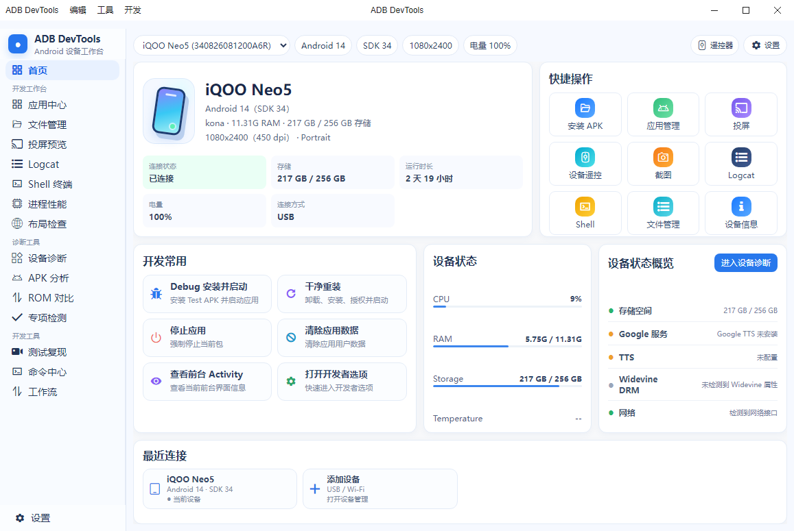

# ADB DevTools 发布页

Android 设备开发与排障工作台的下载页与在线更新清单。

- 下载页：https://huanwuchen.github.io/ADB-DevTools/
- 更新日志：https://huanwuchen.github.io/ADB-DevTools/update.html
- 最新版本清单：https://raw.githubusercontent.com/huanwuchen/ADB-DevTools/gh-pages/update/latest.json

## 发布新版本

1. 上传 Windows 安装包到 GitHub Releases。
2. 更新 `update/latest.json` 中的版本、下载地址、Release 地址和更新说明。
3. 推送 `gh-pages` 分支。
